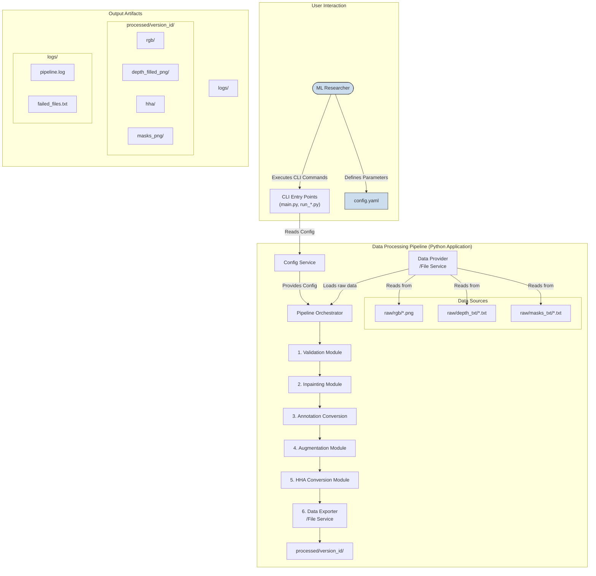
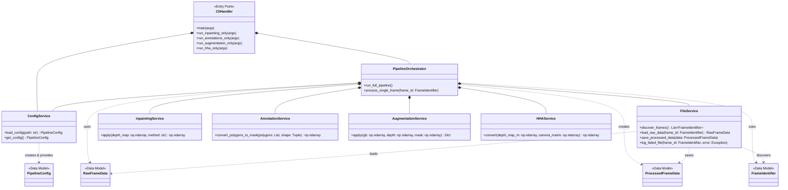

# Project

## Introduction & Vision
This document outlines the requirements for a Proof of Concept \(PoC\) system designed to prepare a specialized dataset for training a `DeeplabV3\+` semantic segmentation model\.The core problem is that raw data from depth cameras, while rich in information, is not in an optimal format for model training\. The goal of this project is to build a data processing pipeline that transforms raw RGB images, depth maps, and polygon annotations into a ready\-to\-use, augmented dataset\. The pipeline's key function is to convert raw depth maps into the HHA \(Horizontal disparity, Height above ground, Angle with gravity\) format, which is believed to provide more informative features for the segmentation task\.The vision is to create a fast, configurable, and reliable tool for a researcher to automate the otherwise manual and error\-prone process of dataset preparation, enabling rapid experimentation and model training\.## Target Audience & User Personas
The system is designed for a single, specific user profile:**The ML Researcher/Developer:** An individual with a technical background who is building and training a computer vision model\. Their primary goal is to quickly and efficiently preprocess raw sensor data into a format suitable for their model\. They are the sole operator and user of the system and prioritize speed of prototyping and correctness of the output over a polished user interface or extensive automated testing\.

## User Stories / Use Cases
As a researcher, I want to convert raw depth maps into the HHA format so that I can provide richer, more descriptive features to my segmentation model\.

As a researcher, I want to automatically fill in gaps and voids in my raw depth maps so that I have a continuous data surface for HHA conversion\.

As a researcher, I want to convert polygon annotations from my annotation tool into single\-channel image masks so that they are compatible with the `DeeplabV3\+` model's input requirements\.

As a researcher, I want to apply the same set of geometric augmentations to my RGB images, depth maps, and segmentation masks simultaneously so that I can increase the size and diversity of my dataset without breaking the correspondence between the data and its labels\.

As a researcher, I want to configure all data processing steps from a single configuration file so that I can easily manage and reproduce my experiments\.

As a researcher, I want to execute the entire data preparation pipeline with a single command for batch processing so that I can efficiently process my entire dataset\.

As a researcher, I want the ability to run individual stages of the pipeline \(e\.g\., only inpainting, only augmentation\) separately so that I can debug and inspect intermediate results more easily\.

As a researcher, I want to ensure the data processing pipeline is deterministic so that I can reproduce an augmented dataset exactly by re\-running the process with the same configuration\.

## Functional Requirements
### Data Ingestion
The system must ingest depth data from text files \(`\.txt`\), where each file represents a single frame\. The format contains one point per line with row, column, and depth value in millimeters\.

The system must ingest standard RGB image files\.

The system must ingest polygon\-based segmentation annotations from text files \(`\.txt`\) in a YOLO\-like format\. Each line in the file represents one object, starting with a class index followed by normalized polygon vertex coordinates\.

Система должна связывать файлы RGB, карты глубины и аннотации для каждого кадра по уникальному идентификатору \(`frame\_id`\), который извлекается из имени исходного RGB\-файла\. \\n\\n**Механизм связи:**\\n1\. Для RGB\-файла \(например, `rgb\_frame\_frame\_1\_20250805\_105953\_167\_png\.rf\.&lt;hash&gt;\.jpg`\) извлекается `frame\_id`: `frame\_1\_20250805\_105953\_167`\.\\n2\. По этому `frame\_id` находятся связанные файлы:\\n    \* **Аннотация:** `raw/annotations/rgb\_frame\_\{frame\_id\}\_png\.rf\.\*\.txt`\\n    \* **Карта глубины:** `raw/depth/depth\_data\_\{frame\_id\}\.txt`\\n\\nТаким образом, `frame\_id` служит универсальным ключом для связи всех исходных данных одного кадра\.

### Data Validation
The system must perform a validation check to ensure that the corresponding RGB image and depth map for a given frame have identical height and width dimensions\.

If the dimensions do not match, the system must raise a critical error for that file and log it, as automatic resizing is not supported\.

### Preprocessing & Transformation
**Depth Data Normalization:** The system must convert depth values from millimeters \(as provided in the input files\) to meters by dividing each value by 1000\.0\. This is a prerequisite for HHA conversion\.

**Depth Inpainting:** The system must fill in missing or invalid pixels \(e\.g\., zeros, NaNs\) in the depth maps\.

Для PoC будет реализован каскадный метод inpainting с двумя шагами:

Сначала применяется линейная интерполяция \(linear\), чтобы получить максимально гладкое и физически правдоподобное восстановление данных\.

Оставшиеся незаполненные пиксели \(если таковые остались\) будут обрабатываться с помощью интерполяции ближайшего соседа \(nearest\), чтобы гарантировать отсутствие пропущенных значений\.

**Annotation Conversion:** The system must convert the YOLO\-style polygon annotations into single\-channel image masks\.

It must first parse the `\.txt` annotation file, reading the class index and normalized coordinates for each polygon\.

It must convert the normalized coordinates \[0, 1\] into absolute pixel coordinates based on the dimensions of the corresponding RGB image\.

It must render each polygon onto a blank image canvas, filling it with the corresponding integer class index\.

### Augmentation
The system must be capable of applying a series of data augmentation transformations\.

All augmentations must be applied **synchronously** to the RGB image, the pre\-HHA depth map, and the segmentation mask to maintain data\-label integrity\.

The augmentations must be applied **before** the HHA conversion step\.

The following augmentations must be supported and configurable for the PoC:

Horizontal Flip

Random Scaling

Random Cropping

Rotation

Padding to a fixed size

The system must allow for deterministic augmentation by using a configurable random seed\.

### HHA Conversion
The system must convert the processed \(in\-painted and augmented\) depth map into a 3\-channel HHA image\.

The conversion process requires a camera calibration matrix\. The system must accept this matrix as a parameter from the configuration\.

Для корректной генерации HHA\-изображений необходимо использование матрицы внутренней калибровки камеры \(intrinsic matrix\)\.

🔧 Принятое решение:Требовать явное указание матриц калибровки для RGB и Depth\-камер в config\.yaml, например:

yamlCopyEditcalibration:rgb\_intrinsics: \[\[fx, 0, cx\], \[0, fy, cy\], \[0, 0, 1\]\]depth\_intrinsics: \[\[fx, 0, cx\], \[0, fy, cy\], \[0, 0, 1\]\]В случае отсутствия одного или обоих параметров:

Пайплайн должен прерывать выполнение с сообщением об ошибке, указывая, какая из матриц отсутствует\.

Это обеспечивает детерминированность поведения и предотвращает генерацию физически некорректных HHA\.

### Data Export
The system must save the original, raw depth map \(before inpainting\) as a single\-channel, 16\-bit PNG file for debugging and comparison purposes\.

The system must save the in\-painted depth map as a single\-channel, 16\-bit PNG file to preserve metric precision\. This version is created after the inpainting step but before augmentations are applied\.

The system must save the generated HHA image as a 3\-channel, 16\-bit PNG file to preserve its dynamic range\.

Принятое решение:HHA и Depth сохраняются в 16\-битных PNG \(uint16\), как основной формат PoC\.

Для конвертации float32 → uint16 применяется масштабирование с коэффициентом scale = 1000, чтобы сохранить значения в миллиметрах\.

Например:

1\.25 м → 1250

0\.5 м → 500

3\.0 м → 3000

Это позволяет сохранить точность и физический смысл данных в рамках допустимого диапазона 0–65535

The system must save the generated segmentation mask as a single\-channel, 8\-bit PNG file\.

If the original RGB image was transformed during augmentation, the transformed version must also be saved\.

Все выходные файлы для одного кадра должны быть четко связаны по имени файла, используя `frame\_id`\. Для каждого `frame\_id` \(например: `frame\_1\_20250805\_105953\_167`\) сохраняются:

 - `frame\_1\_20250805\_105953\_167\_depth\_raw\.png` — исходная карта глубины \(до inpainting\)
 - `frame\_1\_20250805\_105953\_167\_depth\_filled\.png` — карта глубины после inpainting
 - `frame\_1\_20250805\_105953\_167\_hha\.png` — HHA\-изображение
 - `frame\_1\_20250805\_105953\_167\_mask\.png` — маска сегментации

### System Configuration & Control
The primary mechanism for configuration shall be a single YAML file \(`config\.yaml`\)\.

This file must allow configuration of all key pipeline parameters, including input/output paths, inpainting methods, augmentation settings, and the HHA camera matrix\.

The system must support overriding parameters from the YAML file via Command Line Interface \(CLI\) arguments for quick experiments\.

The system must operate in a batch\-processing mode, iterating through all files in the specified input directories\. On\-the\-fly processing is not required for the PoC\.

The user must be able to execute the entire pipeline from a single entry point \(e\.g\., `main\.py`\)\.

The user must also have the option to execute individual pipeline stages \(e\.g\., inpainting, HHA conversion, augmentation\) via separate scripts for debugging and granular control\.

### Error Handling & Logging
The pipeline must not terminate when an error occurs while processing a single file\.

It must log the error with detailed information \(filename, error type, message\) and continue to the next file in the batch\.

A list of all failed files must be saved to a separate text file for later review\.

The pipeline must only terminate on critical, non\-recoverable errors, such as a missing configuration file or invalid directory paths\.

The system must log key events and errors to a log file \(`pipeline\.log`\)\.

A progress bar must be displayed in the console during batch processing, showing progress and estimated time remaining\.

Upon completion, the system must print a summary report to the console, stating the total number of files processed successfully and the number of files skipped due to errors\.

### File & Version Management
The system must use a clear directory structure, separating original \(`raw/`\) and processed \(`processed/`\) data\.

Внутри каждой папки с результатами, создаваемой для одного запуска, должна создаваться следующая структура подкаталогов для хранения разных типов файлов:

```
processed/
└── <run_id>/
    ├── depth_raw_png/
    ├── depth_filled_png/
    ├── hha_png/
    └── masks/

```

Каждый файл сохраняется в свою соответствующую папку\.

To prevent accidental data loss, the system must not overwrite existing processed data on subsequent runs\.

For each execution of the pipeline, a new, uniquely named \(e\.g\., timestamp\-based or version\-indexed like `v001`, `v002`\) sub\-directory must be created within the `processed/` directory to store the output of that run\.

## Non\-Functional Requirements
### Usability
The system shall be operated via a Command Line Interface \(CLI\), which is sufficient for the target technical user\.

Configuration must be straightforward and centralized in a human\-readable YAML file\.

### Performance
The pipeline is expected to run on a standard CPU\. GPU\-specific optimizations are not required\.

The performance should be reasonable for offline batch processing, with the inpainting step for an 800x600 frame expected to complete in 1\-2 seconds on a CPU\.

### Reliability
The system must be robust to file\-level errors and capable of completing a batch run even if some input files are corrupted or invalid\.

### Maintainability
The codebase should include inline comments for key logic blocks \(inpainting, augmentation, HHA generation\)\.

A `README\.md` file must be provided at the root of the project, including a brief project description, setup instructions, and an example of the `config\.yaml` structure\.

## Scope
### In Scope
A complete, end\-to\-end data processing pipeline for a PoC\.

Ingestion of depth \(`\.txt`\), RGB, and polygon annotation \(`\.txt`\) files\.

Configurable depth inpainting\.

Conversion of polygon annotations to segmentation masks\.

Configurable, synchronous data augmentation \(RGB, depth, mask\)\.

Conversion of depth maps to HHA format\.

Flexible configuration via YAML and CLI\.

Robust error handling and logging for batch processing\.

Versioned output directories to prevent data overwrites\.

Execution as a full pipeline or as standalone modules\.

Basic project documentation \(`README\.md` and code comments\)\.

### Out of Scope
Automated unit, integration, or end\-to\-end tests\.

A graphical user interface \(GUI\) or web\-based interface\.

An API for programmatic access\.

Parallel processing or multi\-threading optimizations for the PoC\.

Integration with external monitoring or experiment tracking tools \(e\.g\., MLflow, Weights & Biases\)\.

Containerization \(e\.g\., Docker\)\.

Automatic generation of documentation \(e\.g\., Sphinx\)\.

Automatic resizing or padding of images with mismatched dimensions\.

## Success Metrics
The success of this PoC will be evaluated based on the following criteria:**Primary Metric:** Visual confirmation of output quality\. A random sample of generated data \(HHA images and masks\) will be manually inspected to verify:

Plausibility of the inpainting results\.

Correctness of the synchronous application of augmentations across RGB, HHA, and masks\.

Visual coherence of the generated HHA images\.

**Quantitative Metrics:**

**Processing Success Rate:** The percentage of input files that are processed without errors\. The target is to maximize this rate\.

**Error Count:** The total number of non\-critical errors logged during a full dataset run\. This should be minimal\.

**Processing Time:** Average time to process a single frame, serving as a baseline performance benchmark\.

## Assumptions & Dependencies
### Assumptions
The user of the system is the developer, who understands the pipeline's logic and data formats\.

Input data is well\-organized, with RGB, depth, and annotation files for a single frame sharing a common base filename\.

The system will be run in a local environment controlled by the user\.

### Dependencies
The `DeeplabV3\+` model architecture dictates the required format for the output segmentation masks \(single\-channel 8\-bit PNG with class indices\)\.

The system depends on input data originating from an Orbbec ASTRA 2 camera \(for depth\) and the Roboflow platform \(for annotations\)\.

The availability of a local module or library \(`depth2hha`\) capable of performing the HHA conversion is assumed\.

## System Overview
This document specifies the technical design for a Proof of Concept \(PoC\) data processing pipeline\. The system's purpose is to convert raw sensor data—consisting of RGB images, depth maps from an Orbbec ASTRA 2 camera, and polygon\-based annotations—into a structured, augmented dataset suitable for training a `DeeplabV3\+` semantic segmentation model\.The core technical challenge is the transformation of raw depth data into the HHA \(Horizontal disparity, Height above ground, Angle with gravity\) format\. The pipeline automates several key steps: filling missing depth information \(inpainting\), converting YOLO\-style polygon annotations into pixel\-wise masks, and applying a set of synchronous geometric augmentations to the RGB images, depth maps, and masks\. The entire system is designed as a local, command\-line\-driven tool for a single ML researcher, prioritizing rapid prototyping, correctness of data transformations, and experimental reproducibility\.## Architectural Drivers
### Goals
**Prototyping Velocity:** The architecture must enable rapid implementation and iteration\. The choice of a modular monolithic application with simple file\-based I/O supports this by minimizing boilerplate and deployment complexity\.

**Correctness and Integrity:** The primary goal is to produce a high\-fidelity dataset\. This drives the requirements for synchronous augmentations, metric\-preserving data handling \(e\.g\., 16\-bit PNGs\), and validation checks\.

**Reproducibility:** The entire pipeline must be deterministic\. The use of a configurable random seed for all stochastic operations \(like augmentation\) is mandatory to ensure any generated dataset can be perfectly reproduced\.

**Configurability:** The user must be able to control all aspects of the pipeline \(inpainting methods, augmentation parameters, paths\) from a central configuration file to facilitate easy experimentation\.

### Constraints
**Execution Environment:** The system will be a Python 3\.12 application running on Ubuntu 24\.04 LTS\. It is designed for local, CPU\-only execution\.

**User Interface:** The system will only expose a Command Line Interface \(CLI\)\. No GUI or API is required for the PoC\.

**Testing Strategy:** Formal automated testing \(unit, integration\) is out of scope for the PoC\. Verification will rely on logging, visual inspection of outputs, and summary reports\.

**Dependencies:** The system relies on a specific set of third\-party Python libraries \(`albumentations`, `opencv\-python`, `numpy`, `scipy`, `pyyaml`, `tqdm`, `Pillow`\) and a pre\-existing local module \(`depth2hha`\)\.

**Data Scope:** The system is designed to run in a batch\-processing mode on a finite, local dataset\. On\-the\-fly processing is not a requirement\.

## High\-Level Architecture
The system will be implemented as a modular monolithic application, following a sequential pipeline pattern\. A central orchestrator reads a configuration file and passes data through a series of specialized processing modules\. Each module is responsible for a single transformation step, receiving data from the previous step and passing its result to the next\.The architecture provides two modes of operation:**Full Pipeline Mode:** A single command executes all steps from ingestion to export for the entire dataset\.

**Standalone Module Mode:** Separate entry points allow the user to run individual stages \(e\.g\., only inpainting\) for debugging and inspection of intermediate results\.

### Components Diagram


## Data Architecture and Models
The system operates on file\-based data rather than a structured database\. To ensure type safety, clarity, and consistency across modules, all internal data structures will be defined using Pydantic models\. This enforces a schema\-on\-read and schema\-on\-write discipline for data passed between components\.### Data Storage Strategy
**Input Data:** Raw data is stored in a `raw/` directory, segregated by type \(`rgb/`, `depth\_txt/`, `masks\_txt/`\)\.

**Output Data:** Processed data is written to a versioned sub\-directory within `processed/` \(e\.g\., `processed/v001/`\)\. This prevents data loss from previous runs\. The structure mirrors the input types \(`rgb/`, `depth\_filled\_png/`, `hha/`, `masks\_png/`\)\.

**Intermediate Data:** Data is passed in\-memory between pipeline stages as instances of Pydantic models\. Intermediate results are not written to disk unless for explicit debugging purposes\.

### Data Models \(Pydantic\)
Base models will be used to enforce DRY principles, with specialized models for different pipeline stages\.```python
# file: pipeline/data_models.py
from typing import List, Tuple, Dict, Any, Optional
from pydantic import BaseModel, Field
import numpy as np

class FrameIdentifier(BaseModel):
    """A unique identifier for a single data frame, based on filename."""
    base_name: str
    raw_rgb_path: str
    raw_depth_path: str
    raw_mask_path: str

class CameraIntrinsics(BaseModel):
    """Camera calibration matrix."""
    fx: float
    fy: float
    cx: float
    cy: float

    def to_numpy_array(self) -> np.ndarray:
        return np.array([[self.fx, 0, self.cx], [0, self.fy, self.cy], [0, 0, 1]])

class PipelineConfig(BaseModel):
    """Strongly-typed representation of the config.yaml file."""
    class InpaintingConfig(BaseModel):
        method: str = Field(..., description="e.g., 'linear_nearest', 'rbf', 'none'")
        
    class AugmentationConfig(BaseModel):
        enabled: bool = True
        seed: int = 42
        horizontal_flip_prob: float = 0.5
        random_scale_limit: float = 0.1
        crop_size: Tuple[int, int]
        rotate_limit: int = 15
        pad_if_needed: bool = True

    class CamerasConfig(BaseModel):
        """Configuration for camera intrinsic parameters."""
        rgb_camera_matrix: CameraIntrinsics
        depth_camera_matrix: CameraIntrinsics

    class PathsConfig(BaseModel):
        raw_dir: str
        processed_dir: str
        
    inpainting: InpaintingConfig
    augmentation: AugmentationConfig
    cameras: CamerasConfig
    paths: PathsConfig

class RawFrameData(BaseModel):
    """Data structure for a single, unprocessed frame."""
    identifier: FrameIdentifier
    rgb_image: np.ndarray # Raw depth in millimeters
    depth_map_mm: np.ndarray # Raw depth in millimeters
    polygons: List[Tuple[int, np.ndarray]] # List of (class_id, polygon_coords)

    class Config:
        arbitrary_types_allowed = True

class ProcessedFrameData(BaseModel):
    """Data structure for a frame after processing, ready for export."""
    identifier: FrameIdentifier
    rgb_image: np.ndarray # Potentially augmented
    depth_map_filled_m: np.ndarray # Inpainted and converted to meters
    hha_image: np.ndarray
    segmentation_mask: np.ndarray # 8-bit single-channel mask

    class Config:
        arbitrary_types_allowed = True


```

### Data Flow Diagram
This diagram illustrates the transformation of data entities through the pipeline\.```mermaid
graph TD
    A[raw/depth_txt/*.txt] --> B(Load Depth);
    C[raw/rgb/*.png] --> D(Load RGB);
    E[raw/masks_txt/*.txt] --> F(Load Polygons);

    subgraph "In-Memory Data Transformation"
        B --> G[depth_map_mm: np.ndarray];
        D --> H[rgb_image: np.ndarray];
        F --> I[polygons: List];

        G -- "mm -> meters<br>fill gaps" --> J(Inpainting & Normalization)
        J --> K[depth_map_filled_m: np.ndarray]

        I -- "rasterize polygons" --> L(Annotation Conversion)
        L --> M[segmentation_mask: np.ndarray]
        
        H --> N(Augmentation);
        K --> N;
        M --> N;

        N --> O[Augmented RGB];
        N --> P[Augmented Depth];
        N --> Q[Augmented Mask];
        
        P -- "apply camera matrix" --> R(HHA Conversion);
        R --> S[hha_image: np.ndarray];
    end

    subgraph "Data Export"
        O --> T[processed/version/rgb/];
        P --> U[processed/version/depth_filled_png/];
        S --> V[processed/version/hha/];
        Q --> W[processed/version/masks_png/];
    end

```

## Component Blueprint & Class Diagram
The system's logic is encapsulated in a set of services, each with a distinct responsibility\. This modular design facilitates debugging and allows for standalone execution of pipeline stages\.### Class Diagram


## CLI Interface Design
The system is controlled exclusively via the command line, providing flexibility for both full\-batch processing and granular, single\-stage execution\.### Main Entry Point
The primary script for running the end\-to\-end pipeline\.**Command:** `python main\.py \-\-config \./configs/config\.yaml`

**Function:** Executes the entire pipeline: ingestion, validation, inpainting, annotation conversion, augmentation, HHA conversion, and export\.

**Overrides:** CLI arguments can override `config\.yaml` settings for quick experiments\. Example: `python main\.py \-\-config \./configs/config\.yaml \-\-augmentation\.rotate\_limit 20`

### Standalone Module Entry Points
These scripts enable debugging and inspection of intermediate results\.**Inpainting:** `python run\_inpainting\.py \-\-input\_dir &lt;path&gt; \-\-output\_dir &lt;path&gt; \-\-method rbf`

**Annotation Conversion:** `python run\_annotations\.py \-\-input\_dir &lt;path&gt; \-\-output\_dir &lt;path&gt; \-\-image\_size 800 600`

**HHA Conversion:** `python run\_hha\.py \-\-input\_dir &lt;path&gt; \-\-output\_dir &lt;path&gt; \-\-config \./configs/config\.yaml` \(to access camera matrix\)

**Augmentation:** `python run\_augmentation\.py \-\-input\_rgb &lt;path&gt; \-\-input\_depth &lt;path&gt; \-\-input\_mask &lt;path&gt; \-\-output\_dir &lt;path&gt; \-\-config \./configs/config\.yaml`

## DEVOPS requirements
### Deployment Process
The system is deployed locally by cloning the Git repository\.

Dependencies are installed into a Python virtual environment using a `requirements\.txt` file\.

**Steps:**

`git clone &lt;repository\_url&gt;`

`cd &lt;project\_root&gt;`

`python3\.12 \-m venv venv`

`source venv/bin/activate`

`pip install \-r requirements\.txt`

### System Configuration
All pipeline parameters are managed via a central `config\.yaml` file located in the `configs/` directory\.

A template `config\_example\.yaml` must be provided in the repository with comments explaining each parameter\.

Матрица калибровки depth\-камеры \(`depth\_camera\_matrix`\), используемая для преобразования в HHA, должна быть явно определена в этом файле\.

Конфигурационный файл `config\.yaml` должен в обязательном порядке содержать матрицы внутренних параметров \(intrinsics\) как для RGB, так и для depth\-камеры\. Эти параметры описываются в Pydantic\-модели `PipelineConfig` в разделе `cameras`\. При запуске конвейера конфигурация загружается и валидируется с помощью этой модели\. Если поля `rgb\_camera\_matrix` или `depth\_camera\_matrix` отсутствуют или содержат некорректные данные \(например, не являются массивом 3x3\), Pydantic вызовет ошибку валидации, и приложение немедленно завершит работу\. Такая строгая проверка гарантирует, что конвейер не будет запущен с неверными или отсутствующими параметрами камер, что критически важно для корректного вычисления HHA, зависящего от матрицы depth\-камеры\.

The random seed for augmentations must be configurable to ensure deterministic runs\.

### Monitoring and Logging
**Console Output:** During a run, a `tqdm` progress bar will show the number of processed files, rate, and estimated time remaining\.

**Console Summary:** Upon completion, a summary report will be printed to `stdout` indicating total files processed successfully, total files skipped due to errors, and the path to the output directory\.

**File Logging:**

All events \(INFO, WARNING, ERROR\) are logged to `logs/pipeline\.log` with timestamps\.

A clean list of base filenames that failed processing is written to `logs/failed\_files\.txt` for easy review and reprocessing\.

No external monitoring tools will be integrated for the PoC\.

## Implementation, Validation and Verification Strategy
### Implementation Strategy
The implementation will follow a risk\-first approach, prioritizing the most complex and critical components to de\-risk the project early\.**Phase 1: Core Transformation Logic**

**Annotation Converter:** Implement the parser for YOLO\-style polygons and the rasterization logic using `cv2\.fillPoly`\. This is critical for generating correct labels\. Create a simple script to visually verify that generated masks perfectly overlay corresponding RGB images\.

**HHA Service Wrapper:** Create a service that wraps the `depth2hha` library\. This isolates the external dependency\. The wrapper will handle the conversion of the NumPy depth map and camera matrix into the format expected by the library\.

**Inpainting Service:** Implement the `linear\_nearest` cascade and `rbf` inpainting methods\. Visual inspection of before/after results on sample depth maps with significant gaps is required\.

**Augmentation Service:** Implement the wrapper around `Albumentations`, ensuring the `additional\_targets` feature is used correctly to apply transformations synchronously to RGB, depth, and masks\.

**Phase 2: Pipeline Orchestration**

**Configuration and Data Models:** Implement the Pydantic models and the `ConfigService`\.

**File Service:** Implement the logic for discovering files, loading raw data, and saving processed data according to the versioned directory structure\.

**Orchestrator:** Tie all the services together in the `PipelineOrchestrator`, building the full end\-to\-end flow\.

**Phase 3: CLI and Finalization**

Implement the `main\.py` and standalone `run\_\*\.py` entry points using `argparse` or a similar library\.

Implement robust error handling \(try\-except blocks per file\) and logging\.

Finalize the `README\.md` and code comments\.

### Validation Strategy
As automated tests are out of scope, validation will rely on structured manual checks and visual inspection\.**Visual Verification:** The most critical validation method\. A random sample of outputs from each run must be visually inspected\.

Check that inpainting has filled voids without creating major artifacts\.

Overlay the final mask on the final RGB/HHA image to confirm augmentations were synchronous\.

Review the HHA images for visual coherence\.

**Debug Mode:** A `\-\-debug` flag will be added to the CLI\. When enabled, it will save intermediate visualizations to a `reports/` directory \(e\.g\., depth before/after inpainting, mask overlaid on original RGB\)\.

**Log Analysis:** The `logs/failed\_files\.txt` provides a clear list of data that could not be processed, which must be reviewed to identify systematic issues with input data\.

### Verification Strategy
**Summary Report:** The console output summary \(`X processed, Y failed`\) serves as the primary verification that the pipeline ran to completion over the entire dataset\.

**Reproducibility Check:** Run the pipeline twice with the same configuration and seed\. A byte\-for\-byte comparison of a sample of output files from both runs must confirm that the output is identical\.

**Data Integrity Check:** Verify that the output files are in the correct format as specified:

`depth\_filled\_png/`: 16\-bit, single\-channel PNG\.

`hha/`: 16\-bit, 3\-channel PNG\.

`masks\_png/`: 8\-bit, single\-channel PNG\.

## README\.md
## requirements\.txt
## \.gitignore
## main\.py
## configs/
### config\_example\.yaml
## data/
### raw/
#### rgb/
#### depth\_txt/
#### masks\_txt/
### processed/
## logs/
### \.gitkeep
## reports/
### \.gitkeep
## scripts/
### run\_inpainting\.py
### run\_annotations\.py
### run\_hha\.py
### run\_augmentation\.py
## src/
### pipeline/
#### \_\_init\_\_\.py
#### data\_models\.py
#### config\_service\.py
#### file\_service\.py
#### validation\_service\.py
#### inpainting\_service\.py
#### annotation\_service\.py
#### augmentation\_service\.py
#### hha\_service\.py
#### orchestrator\.py

## Этап 1: Инициализация проекта и определение базовых структур
Создание фундаментальной структуры проекта, включая каталоги, файлы конфигурации, основные модели данных и зависимости\. Этот этап является основой для всей последующей разработки и направлен на валидацию архитектурных решений на ранней стадии\.

### Создание структуры проекта
Создать начальную структуру каталогов и пустых файлов Python для проекта\. Это заложит основу для дальнейшей разработки в соответствии с архитектурой\.

**Структура каталогов:**

```
/
├── configs/
│   └── config_example.yaml
├── data/               # Для примеров данных
│   ├── raw/
│   │   ├── rgb/
│   │   ├── depth/
│   │   └── annotations/
│   └── processed/
├── logs/
├── pipeline/
│   ├── __init__.py
│   ├── data_models.py
│   ├── config_service.py
│   ├── file_service.py
│   ├── annotation_service.py
│   ├── inpainting_service.py
│   ├── hha_service.py
│   ├── augmentation_service.py
│   └── pipeline_orchestrator.py
├── scripts/            # Для отдельных запускаемых модулей
│   ├── __init__.py
│   ├── run_inpainting.py
│   ├── run_annotations.py
│   ├── run_hha.py
│   └── run_augmentation.py
├── .gitignore
├── main.py
├── README.md
└── requirements.txt

```

### Определение моделей данных Pydantic
Реализовать все модели данных в файле `pipeline/data\_models\.py`, используя Pydantic\. Эти модели обеспечат строгую типизацию и валидацию данных, передаваемых между компонентами конвейера\. Скопировать код из спецификации \(пункт 2025\)\.

**Ключевые модели:**

 - `FrameIdentifier`
 - `CameraIntrinsics`
 - `PipelineConfig` \(включая вложенные `InpaintingConfig`, `AugmentationConfig`, `CamerasConfig`, `PathsConfig`\)
 - `RawFrameData`
 - `ProcessedFrameData`

Это критически важный шаг для обеспечения целостности данных\.

### Реализация сервиса конфигурации
Реализовать `ConfigService` в файле `pipeline/config\_service\.py`\. Этот сервис будет отвечать за загрузку YAML\-конфигурации из файла и ее валидацию с помощью модели `PipelineConfig`\.

**Класс ****`ConfigService`**** должен содержать:**

 - Метод `load\_config\(path: str\) \-&gt; PipelineConfig` для чтения и парсинга YAML файла\.
 - Обработку ошибок, если файл не найден или невалиден \(Pydantic сделает это автоматически при парсинге\)\.
 - Возможность хранения загруженной конфигурации для доступа из других частей приложения\.

Создать пример конфигурации `configs/config\_example\.yaml` на основе `PipelineConfig` и требований 2053, 2055\.

### Создание базовой документации и зависимостей
1.**Создать файл ****`requirements\.txt`** и перечислить в нем все необходимые зависимости: `pyyaml`, `numpy`, `pydantic`, `opencv\-python`, `scipy`, `albumentations`, `tqdm`, `Pillow`\.
2.**Создать файл ****`README\.md`** с базовой структурой: Название проекта, Краткое описание, Раздел "Установка" \(с инструкциями по созданию venv и установке зависимостей\) и Раздел "Использование" \(пока пустой\)\.
3.**Создать файл ****`\.gitignore`**, добавив в него стандартные для Python\-проектов записи: `venv/`, `\_\_pycache\_\_/`, `\*\.pyc`, `data/processed/`, `logs/`\.

### Проверка: Архитектура и базовые компоненты
Проверить, что базовая структура проекта соответствует плану\.

**Инструкции для проверки:**

1.**Структура файлов:** Убедитесь, что все каталоги и файлы, указанные в задаче 1\.1, созданы корректно\.
2.**Модели данных:** Откройте `pipeline/data\_models\.py`\. Проверьте, что код соответствует спецификации \(пункт 2025\) и является синтаксически верным\.
3.**Конфигурация:** Откройте `pipeline/config\_service\.py`\. Убедитесь, что класс `ConfigService` реализован и использует `PipelineConfig` для валидации\. Проверьте `configs/config\_example\.yaml` на полноту и понятность\.
4.**Зависимости:** Убедитесь, что `requirements\.txt` содержит все перечисленные библиотеки\.

Этот шаг необходим для подтверждения правильности заложенного фундамента перед началом реализации сложной логики\.

## Этап 2: Реализация ключевых модулей трансформации данных
Реализация основных сервисов, отвечающих за преобразование данных\. Каждый сервис будет разработан и протестирован изолированно, чтобы снизить риски, связанные с наиболее сложными частями конвейера \(конвертация аннотаций, inpainting, HHA\)\.

### Реализация сервиса конвертации аннотаций
Реализовать `AnnotationService` в `pipeline/annotation\_service\.py`\.

**Функциональность:**

1.Создать метод `convert\_polygons\_to\_mask\(polygons: List\[Tuple\[int, np\.ndarray\]\], shape: Tuple\[int, int\]\) \-&gt; np\.ndarray`\.
2.Метод должен принимать список полигонов \(каждый в формате `\(class\_id, coordinates\)`\) и размеры изображения\.
3.Координаты полигонов нормализованы \(от 0 до 1\), их необходимо преобразовать в абсолютные пиксельные координаты\.
4.Создать пустую маску \(numpy\-массив\) нужного размера, заполненную нулями\.
5.Для каждого полигона отрисовать его на маске с помощью `cv2\.fillPoly`, закрашивая область соответствующим `class\_id`\.

Также создать скрипт `scripts/run\_annotations\.py` для автономной проверки сервиса, который читает файл аннотации и сохраняет результирующую маску как изображение\.

### Проверка: Корректность масок сегментации
Необходимо визуально проверить качество сгенерированных масок сегментации\.

**Инструкции для проверки:**

1.Запустите скрипт `scripts/run\_annotations\.py` на тестовом файле аннотаций\.
2.Откройте сгенерированную маску и соответствующее ей RGB\-изображение в любом графическом редакторе\.
3.Наложите маску на RGB\-изображение \(можно сделать ее полупрозрачной\)\.
4.Убедитесь, что контуры закрашенных областей на маске точно соответствуют контурам объектов на исходном изображении\.

Это гарантирует, что данные для обучения модели будут корректными\.

### Реализация сервиса Inpainting для карт глубины
Реализовать `InpaintingService` в `pipeline/inpainting\_service\.py`\.

**Функциональность:**

1.Создать метод `apply\(depth\_map: np\.ndarray, method: str\) \-&gt; np\.ndarray`\.
2.Реализовать каскадный метод `linear\_nearest`:a\. Нормализовать глубину: перевести из миллиметров в метры \(разделить на 1000\.0\)\.b\. Найти маску недопустимых пикселей \(нули или NaN\)\.c\. Применить `scipy\.interpolate\.griddata` с методом `linear`\.d\. К оставшимся незаполненным пикселям применить `scipy\.interpolate\.griddata` с методом `nearest`\.
3.Вернуть заполненную карту глубины в метрах\.

Создать скрипт `scripts/run\_inpainting\.py` для автономного тестирования сервиса, который загружает карту глубины, выполняет inpainting и сохраняет результат для визуальной оценки\.

### Проверка: Качество Inpainting'а карт глубины
Визуально оценить качество восстановления пропусков в картах глубины\.

**Инструкции для проверки:**

1.Запустите `scripts/run\_inpainting\.py` на тестовой карте глубины с пропусками\.
2.Откройте исходное и обработанное изображения карты глубины\.
3.Сравните их\. Убедитесь, что:
4.
    - Пропуски \(черные области\) в исходном изображении были заполнены\.
    - Заполненные области выглядят правдоподобно, без явных артефактов\.
    - Переходы между исходными и заполненными данными плавные \(результат линейной интерполяции\)\.

Это подтверждает, что HHA\-конверсия будет получать на вход корректные данные\.

### Реализация сервиса\-обертки для HHA\-конвертации
Реализовать `HHAService` в `pipeline/hha\_service\.py`\.

**Функциональность:**

1.Предполагается наличие сторонней библиотеки `depth2hha`\.
2.Создать метод `convert\(depth\_map\_m: np\.ndarray, camera\_matrix: np\.ndarray\) \-&gt; np\.ndarray`\.
3.Метод должен принимать карту глубины в метрах и матрицу калибровки камеры\.
4.Вызвать соответствующую функцию из `depth2hha`, передав ей данные в требуемом формате\.
5.Вернуть 3\-канальное HHA\-изображение \(np\.ndarray\)\.

Создать скрипт `scripts/run\_hha\.py` для автономной проверки, который загружает обработанную карту глубины, матрицу из конфига и сохраняет HHA\-изображение\.

### Проверка: Визуальная корректность HHA\-изображений
Визуально оценить сгенерированные HHA\-изображения\.

**Инструкции для проверки:**

1.Запустите `scripts/run\_hha\.py` на тестовой карте глубины \(после inpainting\)\.
2.Откройте полученное HHA\-изображение\.
3.Убедитесь, что изображение выглядит cohérent \(когерентно\)\. Хотя точная интерпретация каналов сложна, изображение не должно содержать очевидных артефактов, шума или искажений, связанных с ошибками в вычислениях\. Каждый канал \(H, H, A\) должен представлять собой плавное изображение\.

### Реализация сервиса аугментации данных
Реализовать `AugmentationService` в `pipeline/augmentation\_service\.py`\.

**Функциональность:**

1.Использовать библиотеку `albumentations`\.
2.Создать метод `apply\(rgb: np\.ndarray, depth: np\.ndarray, mask: np\.ndarray, config: AugmentationConfig\) \-&gt; Dict`\.
3.Сформировать конвейер аугментаций \(`A\.Compose`\) на основе параметров из `config`:
4.
    - `A\.HorizontalFlip`
    - `A\.RandomScale`
    - `A\.Rotate`
    - `A\.RandomCrop`
    - `A\.PadIfNeeded`
5.**Важно:** Использовать `additional\_targets`, чтобы аугментации применялись синхронно к `rgb`, `depth` и `mask`\.
6.Установить `random\.seed`, `np\.random\.seed` и `torch\.manual\_seed` \(если используется\) значением из `config\.seed` для детерминированности\.

Создать скрипт `scripts/run\_augmentation\.py` для тестирования\.

### Проверка: Синхронность аугментаций
Проверить, что геометрические аугментации применяются абсолютно одинаково к RGB, карте глубины и маске\.

**Инструкции для проверки:**

1.Запустите `scripts/run\_augmentation\.py` на тестовом наборе \(RGB, depth, mask\)\.
2.Откройте аугментированные версии всех трех изображений\.
3.Наложите аугментированную маску на аугментированное RGB\-изображение\. Контуры должны идеально совпадать\.
4.Сравните аугментированное RGB и аугментированное depth\. Поворот, обрезка и другие трансформации должны быть идентичны\.

Это ключевая проверка для сохранения целостности данных\.

## Этап 3: Сборка конвейера и реализация файловых операций
Объединение ранее созданных сервисов в единый конвейер\. На этом этапе будут реализованы компоненты, отвечающие за чтение исходных данных, передачу их между сервисами и сохранение результатов\.

### Реализация файлового сервиса \(FileService\)
Реализовать `FileService` в `pipeline/file\_service\.py`\.

**Функциональность:**

1.**Поиск кадров:** Метод `discover\_frames\(path: str\) \-&gt; List\[FrameIdentifier\]` для поиска всех наборов данных \(RGB, depth, annotation\) и создания списка объектов `FrameIdentifier` на основе `frame\_id`\.
2.**Загрузка данных:** Метод `load\_raw\_data\(frame\_id: FrameIdentifier\) \-&gt; RawFrameData` для загрузки RGB, карты глубины \(из \.txt\) и полигонов \(из \.txt\) в объект `RawFrameData`\.
3.**Сохранение данных:** Метод `save\_processed\_data\(data: ProcessedFrameData, output\_dir: str\)` для сохранения всех артефактов из `ProcessedFrameData` в соответствующие подпапки \(`hha\_png`, `masks`, `depth\_filled\_png` и т\.д\.\)\. Учесть требования к форматам \(16\-bit PNG, 8\-bit PNG\) и именованию файлов\. Реализовать масштабирование для 16\-bit PNG \(float \* 1000\)\.

### Реализация оркестратора конвейера \(PipelineOrchestrator\)
Реализовать `PipelineOrchestrator` в `pipeline/pipeline\_orchestrator\.py`\.

**Функциональность:**

1.В конструкторе принимать экземпляры всех необходимых сервисов \(`FileService`, `InpaintingService` и т\.д\.\) и `PipelineConfig`\.
2.Метод `run\_full\_pipeline\(\)`:a\. Получает список кадров от `FileService`\.b\. Итерируется по каждому кадру\.c\. Для каждого кадра вызывает `process\_single\_frame\(\)`\.
3.Метод `process\_single\_frame\(frame\_id: FrameIdentifier\)`:a\. Вызывает `FileService\.load\_raw\_data`\.b\. Выполняет валидацию размеров \(требование 1020\)\.c\. Последовательно вызывает сервисы: `InpaintingService`, `AnnotationService`, `AugmentationService`, `HHAService`\.d\. Передает данные между шагами, используя модели `RawFrameData` и `ProcessedFrameData`\.e\. Вызывает `FileService\.save\_processed\_data`\.

### Проверка: Интеграция и работа полного конвейера
Проверить, что все сервисы корректно соединены и конвейер работает от начала до конца на одном тестовом файле\.

**Инструкции для проверки:**

1.Создать временный скрипт для запуска `PipelineOrchestrator\.process\_single\_frame\(\)`\.
2.Запустить его на одном полном наборе тестовых данных \(rgb, depth, annotation\)\.
3.Проверить, что в папке с результатами \(`processed/&lt;run\_id&gt;/`\) созданы все ожидаемые файлы:
4.
    - `\_hha\.png`
    - `\_mask\.png`
    - `\_depth\_filled\.png`
    - `\_depth\_raw\.png`
    - аугментированный `\_rgb\.png` \(если аугментация включена\)\.
5.Визуально выборочно проверить качество итоговых файлов\.

## Этап 4: Реализация CLI, обработка ошибок и финализация
Завершающий этап, на котором проект превращается в готовый к использованию инструмент\. Будет добавлен пользовательский интерфейс командной строки, надежная система логирования и обработки ошибок, а также финальная документация\.

### Реализация интерфейса командной строки \(CLI\)
Реализовать CLI в `main\.py`\.

**Функциональность:**

1.Использовать `argparse` или аналогичную библиотеку\.
2.Добавить обязательный аргумент `\-\-config` для указания пути к `config\.yaml`\.
3.Реализовать парсинг аргументов для переопределения параметров из конфига \(например, `\-\-augmentation\.seed 43`\)\.
4.В `main` функции:a\. Загрузить конфигурацию через `ConfigService`\.b\. Переопределить параметры из CLI\.c\. Инициализировать все сервисы и `PipelineOrchestrator`\.d\. Запустить `PipelineOrchestrator\.run\_full\_pipeline\(\)`\.

### Внедрение системы логирования и обработки ошибок
Обеспечить надежность и информативность работы конвейера\.

**Функциональность:**

1.**Обработка ошибок:** В цикле обработки файлов в `PipelineOrchestrator` обернуть вызов `process\_single\_frame` в блок `try\.\.\.except`\.
2.При возникновении исключения:a\. Записать информацию об ошибке в лог\-файл `logs/pipeline\.log` \(имя файла, текст ошибки\)\.b\. Записать `frame\_id` в `logs/failed\_files\.txt`\.c\. Продолжить выполнение со следующего файла\.
3.**Логирование:** Настроить модуль `logging` для вывода сообщений в `logs/pipeline\.log` и в консоль\.
4.**Прогресс\-бар:** Обернуть цикл обработки файлов в `tqdm` для отображения прогресса\.
5.**Итоговый отчет:** После завершения цикла вывести в консоль сводку: количество успешно обработанных файлов, количество сбоев\.

### Финализация документации \(README\.md\) и комментариев в коде
Подготовить проект к использованию другим исследователем\.

**Задачи:**

1.**README\.md:**
2.
    - Заполнить раздел "Использование", добавив пример команды для запуска `main\.py`\.
    - Описать структуру `config\.yaml`, скопировав `config\_example\.yaml` и добавив комментарии к каждому параметру\.
3.**Комментарии в коде:**
4.
    - Пройти по ключевым файлам \(`pipeline\_orchestrator\.py`, `inpainting\_service\.py`, `augmentation\_service\.py` и др\.\)\.
    - Добавить docstrings к классам и методам, объясняющие их назначение\.
    - Добавить inline\-комментарии для сложных или неочевидных участков кода\.

### Итоговая проверка: Комплексное тестирование PoC
Провести финальную проверку всего приложения для подтверждения его готовности\.

**Инструкции для проверки:**

1.**Запуск на наборе данных:** Запустите `python main\.py \-\-config \.\.\.` на директории с несколькими \(5\-10\) тестовыми файлами, включая один заведомо некорректный \(например, с неверным форматом\)\.
2.**Проверка вывода консоли:**
3.
    - Отображается ли прогресс\-бар `tqdm`?
    - Выводится ли в конце корректный итоговый отчет \(N успешно, 1 сбой\)?
4.**Проверка логов:**
5.
    - В `logs/pipeline\.log` есть запись об ошибке для некорректного файла?
    - В `logs/failed\_files\.txt` присутствует имя этого файла?
6.**Проверка результатов:**
7.
    - Создана ли версия директория в `processed/`?
    - Содержат ли они корректный набор выходных файлов для успешно обработанных данных?
8.**Проверка воспроизводимости:** Запустите конвейер дважды с одинаковым `seed` в конфиге\. Сравните побайтово несколько выходных файлов \(например, HHA и маску\) из обоих запусков\. Они должны быть идентичны\.